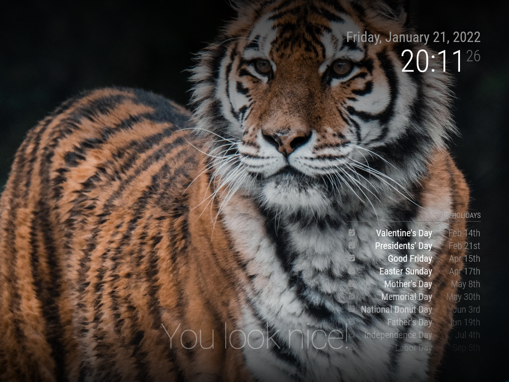
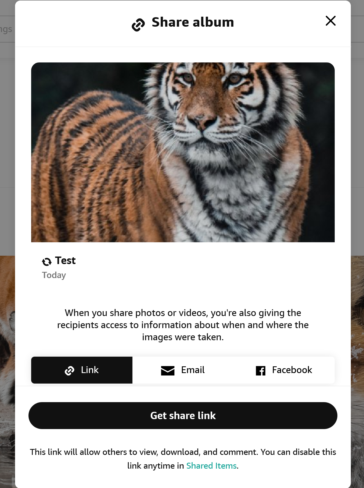
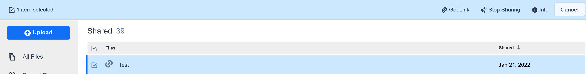

# Amazon Photos - Magic Mirror Module

> [Magic Mirror](https://docs.magicmirror.builders) Module to get Amazon Photos as background images


Background Picture by https://unsplash.com/@thesaboo

## ⚠️ A Word of Caution

[Amazon Photos](https://www.amazon.com/Amazon-Photos/b?node=13234696011) does not offer any official API. To access your Amazon Photos with this module currently means you have to create a public link to them (details on how to do that follow later). It doesn't mean that everybody will be able to see the pictures of your last vacation now, as the link contains a hard-to-guess ID. Nonetheless, with enough time and resources, somebody may be lucky and guess the ID to your images.

## Installation

Run these commands at the root of your **MagicMirror²**

```bash
cd modules
git clone https://github.com/sthuber90/mmm-amazon-photos
```

## Usage

To use this module, add the following configuration block to the modules array in the config/config.js file:

```javascript
var config = {
  modules: [
    {
      module: 'mmm-amazon-photos',
      // position is important
      position: 'fullscreen_below',
      config: {
        // see below for configurable options
      },
    },
  ],
}
```

On Amazon Photos select the album you want to use.

Click the share button and generate a shared link.

In case, the link does not follow the format specified under configuration adjust it.

On Amazon Drive you can find all your shared links and remove them here if you want to stop sharing a certain album.

It's also possible to share only certain pictures from an album or from Amazon Drive.


## Configuration

- `imageUrls` (`Array<string>`) **required**
  - Array of URLs to publicly available Amazon Photos
  - the URL follows the structure of _https://amazon.com/clouddrive/share/your-unique-share-id_. The URL will be split inside the module into:
    - `baseUrl`, e.g. _https://amazon.com_
    - `shareId`, e.g. _your-unique-share-id_
- `backgroundSize` (`string`)
  - refers to [CSS background-size](https://developer.mozilla.org/en-US/docs/Web/CSS/background-size). Valid values **cover**, **contain**
    - **cover** [default]: Resize the background image to cover the entire container, even if it has to stretch the image or cut a little bit off one of the edges
    - **contain**: Resize the background image to make sure the image is fully visible
- `backgroundPosition` (`string`)
  - refers to [CSS background-position](https://developer.mozilla.org/en-US/docs/Web/CSS/background-position). Most useful options: **top** or **center** [default] or **bottom**.
- `slideshowSpeed` (`number`)
  - the speed at which to switch between images, in milliseconds. Defaults to 1 hour.
- `focus` (`boolean`)
  - Default is **true**. If set to true adds a click handler to the gradient to toggle other module visibility. Works only together with the gradient.
- `gradientDirection` (`string`)
  - defines the gradient direction for better contrast to other modules. Valid values **vertical** [default], **horizontal**, **both**, where **both** will result in a vignette like effect
- `gradient` (`Array<string>`)

  - value set as linear gradient in CSS
  - Defaults to

    ```
        ['rgba(0, 0, 0, 0.75) 0%',
        'rgba(0, 0, 0, 0) 40%',
        'rgba(0, 0, 0, 0) 80%',
        'rgba(0, 0, 0, 0.75) 100%', ]

    ```

## Testing

Automated tests are planned but currently hard to implement. However, if you have Docker installed locally, you can run `npm run test:docker`. This will run [karsten13/magicmirror](https://karsten13.de/magicmirror/) and make MagicMirror² with the Amazon Photos module accessible on _http://localhost:8080_

## Contribution

Contributions are welcome. For feature requests and to track bugs please open an issue.
